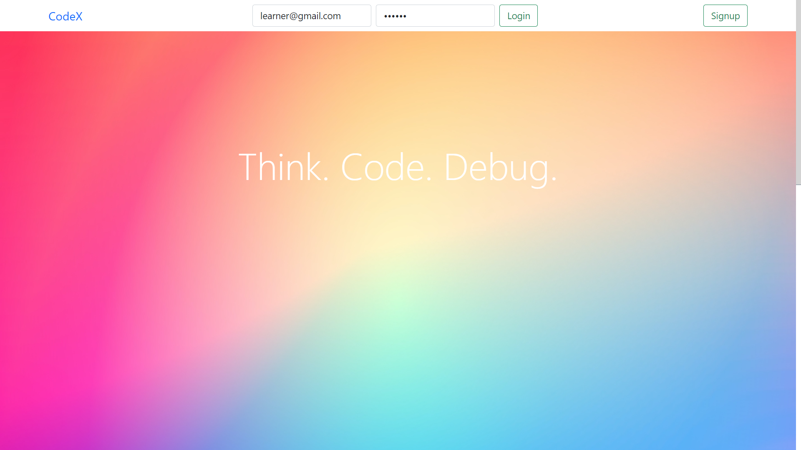
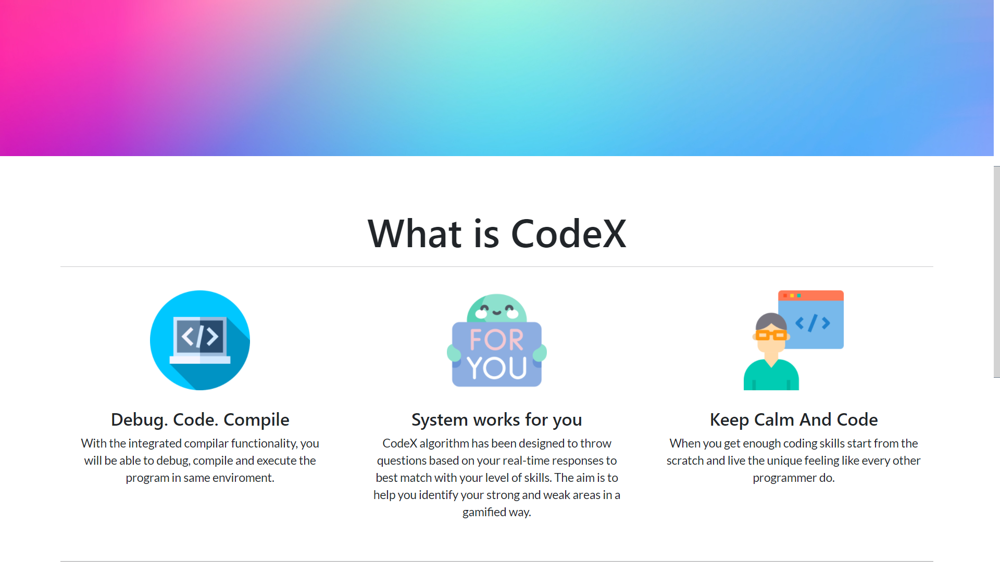
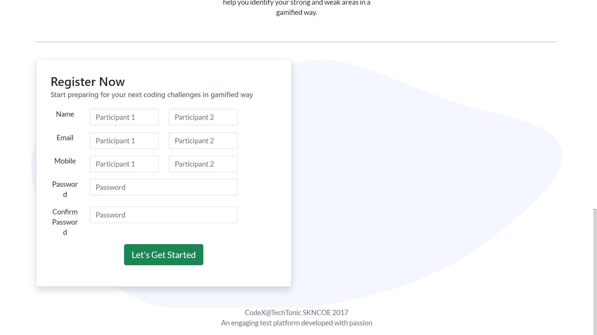

# codeX1.0
 An Adaptive Coding Test Platform. 

# Feature List 

- Dynamic Leaderboard
   Every participant can see the leaderboard and see how they are competing with other participant's in real time.

- Integrated c++ editor for compiling and executing programs
   Write code, compile and see the result in the environment itself

- Smart algorithms that decides the difficulty level based on previous responses in realtime.
   The system was mainly designed to boost participant's confidence in computer programming. It motivates an individual by making programming seem easy and doable.

- Support for resuming quiz in case of failure
   System takes care of the state management. Pariticipant can resume the test in case he/she runs into any technical problems like Internet connectivity issue, power cut etc.

# Achievement

 - Over 600 participations.
 - Tested over load of 80 concurrent users without any lag which was impressive at that time considering the limited computing power, lack of sophisticated resources and this being my very first attempt of full fledge application development.
 - Gamified the computer programming learning

# Images

* Landing Page

* What is CodeX

* Registration Form

* Competative Test Page

* Demonstrating Defence Mechanism - Confirming logout action

